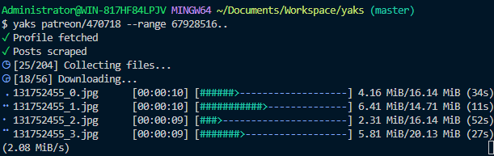

# YaKS: Yet-another Kemono Scraper

It downloads content from Kemono.



[![[DOWNLOAD]](https://img.shields.io/badge/DOWNLOAD-Windows--x86__x64-0078D7)](https://github.com/dec32/yaks/releases/download/nightly/yaks-windows-x86_64.exe)  
[![[DOWNLOAD]](https://img.shields.io/badge/DOWNLOAD-macOS--aarch64-D2D3D4)](https://github.com/dec32/yaks/releases/download/nightly/yaks-macos-aarch64)  
[![[DOWNLOAD]](https://img.shields.io/badge/DOWNLOAD-Linux--x86__x64-F2E15D)](https://github.com/dec32/yaks/releases/download/nightly/yaks-linux-x86_64)  

## Why another one?

The popular ones do not support arranging files into different folders with custom names, have laggy and buggy interfaces and are kinda slow.

## How to use it?

Just use the command:

```Bash
# Also accepts the format {platform}/{user_id}. e.g. fanbox/123456
yaks $url
```

to download all the files from an artist.

You can filter out posts by their IDs using `--range`

```Bash
# Ranges are left-closed, like [a, b)
yaks $url --range ..67890
yaks $url --range 12345..
yaks $url --range 12345..67890
```

By default the files are saved to the download folder[^1], named as `{post_id}_{index}` and go into a folder named by the artist's `{nickname}`.

To save the files elsewhere and arrange them differently, use `--out` and `--format`:

```Bash
# use `/` to create sub-folders
yaks $url --out /some/other/place --format {username}/{title}/{filename}
```

Supported placeholders are:
- `{nickname}`, `{username}` and `{user_id}` of artists
- `{post_id}` and `{title}` of posts
- `{filename}` and `{index}` of files

You probably don't need to adjust the level of concurrency, but `--jobs` controls that.

```Bash
# My internet is super fast and I am not afraid of 429 Too Many Request.
yaks $url --jobs 255
```

## You say I need to type the arguments every single time?

No, you can create the configuration file `yaks/conf.toml` under the config folder[^2] and save your prefered arguments there:

```toml
out = "/some/other/place"
format = "{username}/{title}/{filename}"
jobs = 16
```

## But I want a GUI

I am working on it.

[^1]: `C:\Users\{YOUR_USERNAME}\Downloads` on Windows and `~/Downloads` on macOS and Linux.
[^2]: `C:\Users\{YOUR_USERNAME}\AppData\Roaming` on Windows, `~/.config` on Linux and `~/Library/Application Support` on macOS
